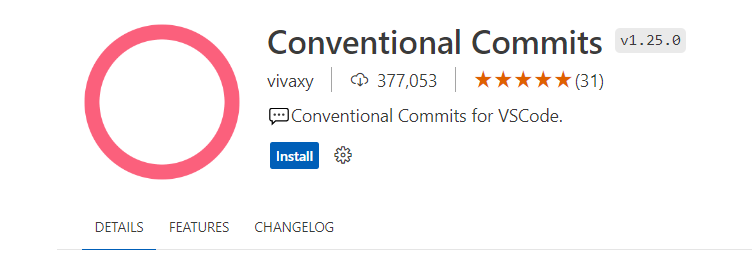

# Padrões e técnicas avançadas com Git e Github

## Git Flow

Podemos utilizar o git flow através da extensão do git ou de forma manual (recomendado pois com a extensão é feito merge dos hotfix diretamente na main).

Iniciando o git flow no nosso repositório: `git flow init`

Criação de uma nova feature para desenvolvimento: `git flow feature start <nome-feature>`

Nesse ponto fazemos as alterações necessárias e fazemos o commit na branch:

- git status
- git add .
- git commit -m 'Comentário do commit'

Finaliza a feature: `git flow feature finish <nome-feature>`

> [!NOTE]
> Ao finalizar a feature é feito automaticamente um merge das alterações na branch Develop.

Gerando uma release: `git flow release start <versao-release>`

Finalizando a release: `git flow release finish <versao-release>`

Criando branch para correção de bug na main: `git flow hotfix start <nome-hotfix>`

Finalizar a correção do bug: `git flow hotfix finish <nome-hotfix>`

> [!CAUTION]
> Ao finalizar um hotfix é feito merge automático das alterações para as branches main e develop.

## Git Hub

### Configurando assinatura de commits

Para isso será utilizado o GPG, que normalmente é instalado junto com o git.

Windows: https://www.gpg4win.org/

> [!TIP]
> Recomenda-se fazer essa configuração utilizando Linux no WSL 2

1. Verificando as chaves existentes

- `gpg --list-secret-key --keyid-form LONG`

2. Gerando uma nova chave

- `gpg --full-generate-key`
- Parâmetros do processo:
  - Escolher RSA and RSA (default)
  - Tamanho: 4096
  - Tempo de expiração: 1y
  - Nome: Tiago Mansur
  - Email: tiago.mansur@hotmail.com

3. Gerando o token público

- `gpg --armor --export <id-chave-gerada>`

4. Configurando Git Hub

- Incluir a chave pública em: **Git Hub | Configurações | SSH and GPG Keys | New GPG Key**

5. Configurando o Git

- `git config --global user.signingkey <id-chave-gerada>`

6. Criação de variavel de ambiente da assinatura

- `export GPG_TTY=$(tty)`

  > [!IMPORTANT]
  > Deve-se alterar o arquivo que é utilizado ao carregar o terminar e inserir o comando anterior.
  > Linux: `vim ~/.bash_profile`

7. Configurar assinatura do commit como padrão

- Apenas para o repositório atual:

  - `git config commit.gpgsign true`

- Configuração global:
  - `git config --global commit.gpgsign true`

8. Configurar assinatura das tags como padrão

- `git config --global tag.gpgSign true`

9. Configurando o agent para não solicitar senha nos commits:

- vim ~/.gnupg/gpg.conf
  - Incluir: use-agent
- `gpgconf --launch gpg-agent`

### Editando chave

1. Abrindo a chave para edição:

- `gpg --edit-key <id-chave>`

2. Incluir informações de identificação que será adicionada a chave

- `adduid`

3. Configurar novo usuário como confiável

- `uid 2`
- `trust`

## Pull Requests

### Extensão

GitHub Pull Requests

## Code Review

### Code Owners

...

## SemVer - Semantic Versioning

https://semver.org/lang/pt-BR/

`MAJOR.MINOR.PATCH`

MAJOR - Versão principal do sistema/Versão da API pública

MINOR - Adicionado funcionalidades, mas compatível com a API

PATCH - Bugs/ajustes

## Conventional Commits

https://www.conventionalcommits.org/en/v1.0.0/

Template:

~~~
<tipo>[escopo opcional]: <descrição>

[corpo opcional]

[rodapé(s) opcional(is)]
~~~

Tipos: fix, feat, BREAK CHANGE, build, chore, etc.

### Extensão para VS Code

Conventional Commits

### Commitlint

https://commitlint.js.org/

Ajuda na revisão do padrão estabelecido para os commits.

### Commitsar

https://commitsar.aevea.ee/

Analiza o histórico de commits verificando se estão dentro dos padrões do Conventional Commits.

> [!TIP]
> Caso de erro na execução dos comandos dockers descritos na documentação da ferramenta, executar o comando a seguir que informa o nome do binário (commitsar) e o diretório que será analisado.
> `docker run --rm --name="commitsar" -w /src -v "$(pwd)":/src aevea/commitsar commitsar .`

### Commitizen

Alternativa ao Commitlint que roda diretamente no terminal.

https://github.com/commitizen/cz-cli

